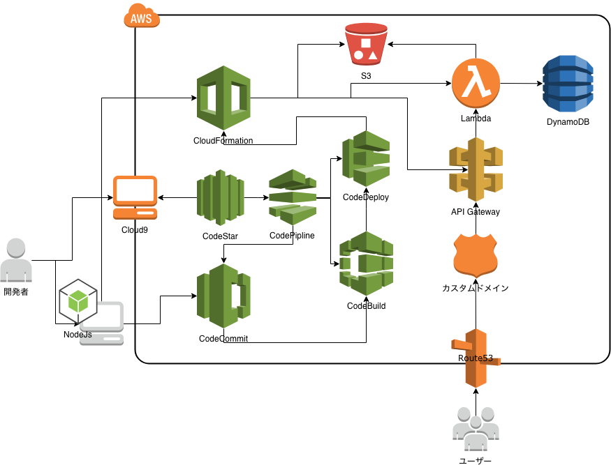
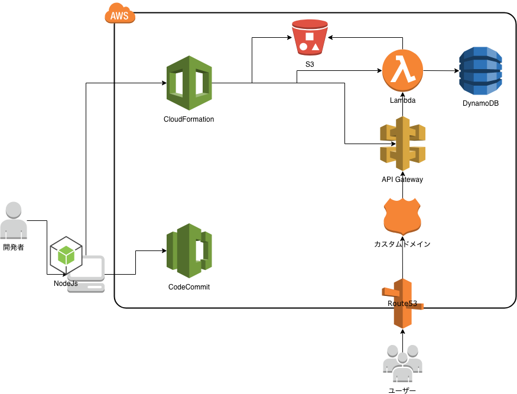
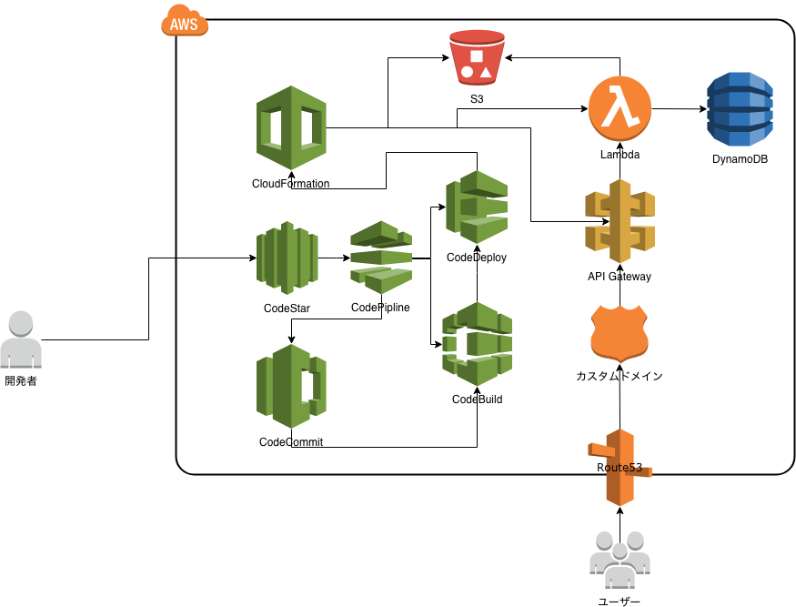

### AWS CodeStarを使ったサーバレスアプリケーション

Note:
---

### 自己紹介

- カキギカツユキ
- おっさんプログラマ
- 元SE
- 今は事業会社でシステム開発とかやってます
- メインの言語は Ruby と JavaScript

Note:
- 業務（システム・売掛金管理）3:開発 (コンサル・研究）7
- Amazonマーケットプレイスの売上データが去年の11月から税抜になって売上が減っていたのが先月のハイライト
---

#### 構成

- 自己紹介
- AWS CodeStarとは
- Mr.M COFFEEプロジェクト開発デモ
- ふりかえり

Note:
- 今日話す内容
- 開発者向け
- 業務・管理者にとってはこうやって作るのねといったイメージで
- 開発・本番デプロイを非同期で進めながらやります
---

サクッとナウでヤングな

サーバレスアプリケーション環境を構築したい

Note:
---

[AWS CodeStar](https://aws.amazon.com/jp/codestar/)を使いましょう

Note:
---

### AWS CodeStarとは

- さまざまなプロジェクトテンプレートから選択可能
- AWS での開発をわずか数分で開始できる
- ソフトウェアデリバリーを 1 つの場所で管理

Note:
- オハイオリージョンを用意しておく
---

さまざまなプロジェクトテンプレートから選択可能

Note:
- sampleプロジェクトを作る
---

AWS での開発をわずか数分で開始できる

Note:
- demoプロジェクトを開く
---

ソフトウェアデリバリーを 1 つの場所で管理

Note:
---

#### CodeStarの構成

- IDE
- コード
- ビルド
- パイプライン
- プロジェクト

Note:
- IDE: AWS Cloud9
- コード: CodeCommit
- ビルド: CodeBuild
- パイプライン: CodePipeline
- コード３兄弟を１つの場所から
---

### Mr M.COFFEEプロジェクト開発デモ

Note:
- 実際にどのように使われるかを実演する
---

#### サイトページ

https://mr-mcoffee.hiroshima-arc.org/index.html

Note:
---

#### 管理ページ

https://mr-mcoffee.hiroshima-arc.org/admin/login

Note:
---

普通のサイトしてるだろ。

ウソみたいだろ。

サーバレスで動いているんだぜ。

それで。

Note:
---

#### アーキテクチャ

Note:
---

#### サーバレスアプリケーションの開発 

Note:
- 東京リージョンに切り替える
- 東京リージョンだとCloud9は使えない
- JIRAのタスクを確認する
---

#### ステージング環境

https://dev-mr-mcoffee.hiroshima-arc.org/index.html

Note:
- Fixブランチに切り替え済みのIDEに切り替える
- src/resources/templates/index.htmlを修正する
- 修正を確認したらステージング環境にデプロイする
- デプロイに入ったらCloudFormationを表示する
- デプロイが終わるまでの間にサーバレスアプリケーションについて解説する
---

#### サーバレスアプリケーション

[AWS サーバレスアプリケーションモデル](https://aws.amazon.com/jp/serverless/sam/)

Note:
---

#### サーバレスアプリケーションモデル(SAM)とは

- 設定は一箇所
- サーバレスアプリケーションがローカルでテスト・デバッグできる
- 開発ツールとの統合

Note:
- CodeStarをオハイオリージョンに切りかえてCloud9を開く
- template.yml
- Cloud9でHelloWorldを実行する
- HelloWorldをデバッグする
---

#### サーバレスアプリケーションのリリース

Note:
---

#### プロダクション環境

https://mr-mcoffee.hiroshima-arc.org/index.html

Note:
- 変更ブランチをコミットしてプッシュする
- CodeStarを東京リージョンに切り変えてCodeCommitを開く
- プルリクエストを作成してマージする
- ビルドプロセスに入ったらふりかえりに入る
---

### ふりかえり

---

#### Keep

- AWS での開発をわずか数分で開始できる
- ソフトウェアデリバリーを 1 つの場所で管理

Note:
---

#### Problem

- さまざまなプロジェクトテンプレートから選択可能
- サーバレスアプリケーションの制約

Note:
- Rubyのサーバレスアプリケーションがない・・・
- CodeStarを使わなくてもPython(Flask) Ruby(Sinatra) Java(SpringBoot) で同様のサイトは作れる
- ファイル容量250MB
- アセット読み込み
- インチキログイン画面
- 今回の主題とは関係ないけどDynamoDB
---

#### Try

- [AWS Amplify](https://aws.amazon.com/jp/amplify/)でサーバレスWebアプリのリファクタリング

Note:
- 認証の実装
- EC2インスタンス、ElasticBeanstalkによる運用
- APIとWebインターフェースの分離
---

### おわり